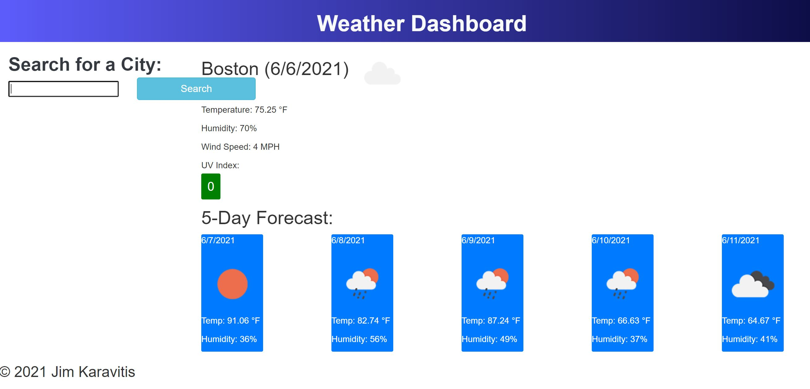

# Weather Checker
Quickly check live weather updates with the OpenWeather API

## Description
This weather checker has been designed to pull and display weather information for cities across the United States. The application fetches information from OpenWeather's API and displays information such as time, temperature, UV index, 5-day forecast and various graphics to enhance presentation. The application also stores previously searched cities for future use. 

### Issues Resolved
* OpenWeather API fetches real-time data
* localstorage used to store data
* City search history saved and listed
* Information displayed: City name, date, icon representation of weather, temperature, humidity, wind speed, UV index
* 5-Day forecast of future weather

### Issues Remaining
* Search button not sitting underneath searchbar
* Search button does not always register but 'enter' button on keyboard always works

## Link to Weather Checker

[Click here to check the weather!](http://jk1956.github.io/Weather_Checker/)

## Screenshots of deployed page
S
The Weather Checker will appear as the following once deployed in a traditonal desktop browser:

## Sources

* [OpenWeather API](https://openweathermap.org/)
* [Bootstrap v5.0](https://getbootstrap.com/docs/5.0/getting-started/introduction/)
* [CSS Color Gradient](https://www.w3schools.com/css/css3_gradients.asp)
* [JSON assistance for OpenWeather API](https://stackoverflow.com/questions/51832321/trying-to-parse-openweather-api-for-json)
* [More JSON / JS / OpenWeather assistance](https://rapidapi.com/blog/openweathermap-api-overview/javascript/)
* [Add class for UV conditions](https://stackoverflow.com/questions/18282708/javascript-ifcondition-then-addclass)

## Credits

Project idea and supplementary code provided in module 6 of UCF Bootcamp. Weather information provided by OpenWeather API. Code used from Bootstrap, JQuery, Stack Overflow and W3 Schools.
